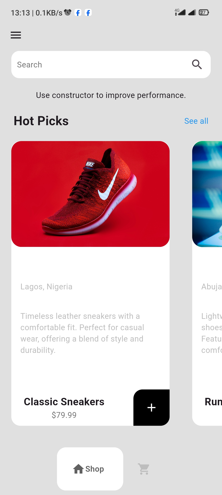

# Minimal Shop App

A simple and intuitive shopping app built using Flutter.  
This app allows users to browse products, add them to a cart, and complete their purchases.

## Features

- **Product Browsing**: View a list of products with details like name, description, and price.
- **Add to Cart**: Add products to the shopping cart and manage cart items.
- **Checkout**: Complete the purchase by proceeding to the checkout screen.
- **Minimalist Design**: Focused on a clean, user-friendly interface.

## Screenshots

<p align="center">
  
  
  
  
</p>

<p align="center">
  
  
 
</p>

## Getting Started

A few resources to get you started if this is your first Flutter project:

- [Lab: Write your first Flutter app](https://docs.flutter.dev/get-started/codelab)
- [Cookbook: Useful Flutter samples](https://docs.flutter.dev/cookbook)

For help getting started with Flutter development, view the
[online documentation](https://docs.flutter.dev/), which offers tutorials,
samples, guidance on mobile development, and a full API reference.

### Prerequisites

- Flutter SDK: [Install Flutter](https://flutter.dev/docs/get-started/install)
- A code editor (VS Code, Android Studio, etc.)

### Installation

1. **Clone the repository:**
    ```bash
    git clone https://github.com/yourusername/minimal-shop.git
    cd minimal-shop
    ```

2. **Install dependencies:**
    ```bash
    flutter pub get
    ```

3. **Run the app:**
    ```bash
    flutter run
    ```

## Project Structure

The project is organized as follows:

```plaintext
lib/
├── models/         # Models and services for product and cart data
├── screens/      # UI screens for browsing, cart, and checkout
├── utils/        # Utility functions for shopping features
└── main.dart     # Entry point of the app
